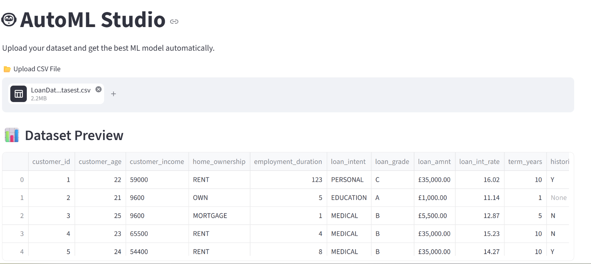
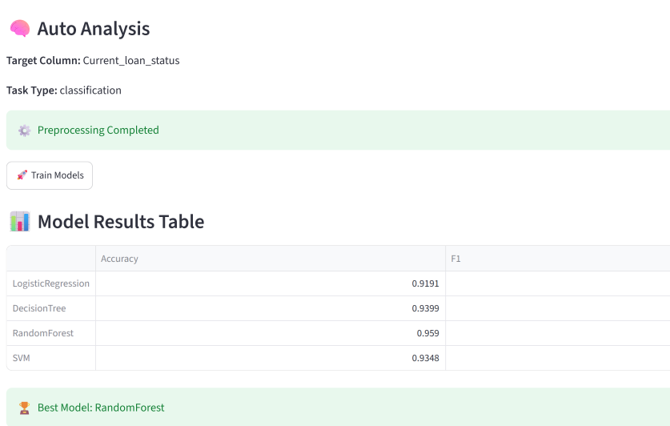
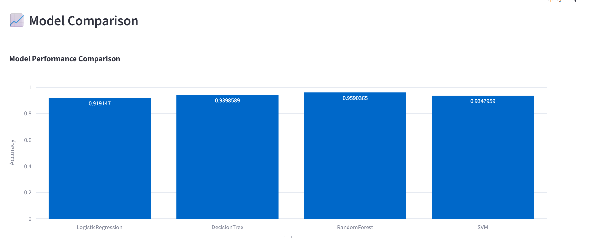
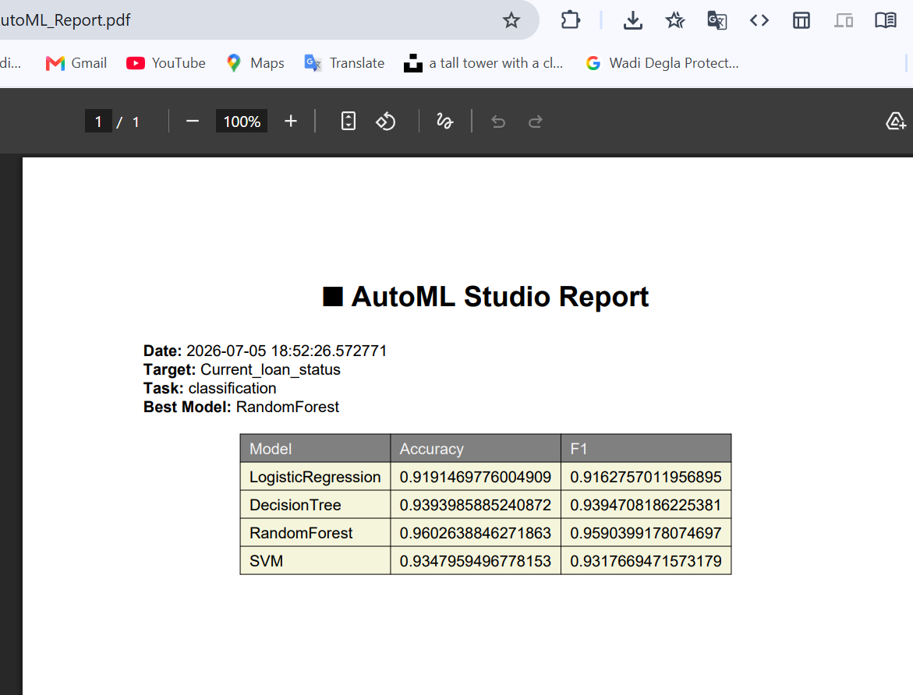

# 🤖 AutoML Studio

AutoML Studio is an automated machine learning platform that helps users build machine learning models without writing ML code.

Users can upload their datasets, and the system automatically analyzes the data, preprocesses it, trains multiple machine learning models, compares their performance, and generates a detailed report.

---

## ✨ Features

- 📂 Upload CSV datasets
- 🔍 Automatic data exploration and analysis
- 🧹 Automated data preprocessing
- 🤖 Automatic model selection
- ⚙️ Train multiple machine learning algorithms
- 📊 Compare model performance
- 🏆 Select the best performing model
- 📈 Generate evaluation metrics and visualizations
- 📄 Export complete ML report as PDF

---

## 🖥️ Application Preview

<p align="center">
  
</p>

<p align="center">
    

</p>

<p align="center">
    

</p>
<p align="center">
    

</p>

---

# 🛠 Tech Stack

## Programming Language

- Python

## Machine Learning

- Scikit-learn
- Pandas
- NumPy

## Data Visualization

- Plotly
- Matplotlib

## Web Framework

- Streamlit

## Report Generation

- ReportLab

---

# 🧠 Machine Learning Pipeline

The application follows an automated ML workflow:

```
Dataset Upload
        |
        ↓
Data Analysis
        |
        ↓
Data Cleaning
        |
        ↓
Feature Processing
        |
        ↓
Model Training
        |
        ↓
Model Evaluation
        |
        ↓
Best Model Selection
        |
        ↓
Report Generation
```

---

# 🤖 Supported Models

## Classification

- Logistic Regression
- Random Forest Classifier
- Support Vector Machine
- K-Nearest Neighbors
- Naive Bayes

## Regression

- Linear Regression
- Random Forest Regressor
- Support Vector Regression

---

# 📊 Evaluation Metrics

## Classification

- Accuracy
- Precision
- Recall
- F1 Score
- Confusion Matrix

## Regression

- R² Score
- Mean Absolute Error
- Mean Squared Error


---

# 🚀 Installation

Clone the repository:

```bash
git clone https://github.com/bayomi-bit/AutoML-Studio.git
```


Run application:

```bash
streamlit run app.py
```

---

# 📌 How To Use

1. Upload your CSV dataset
2. Select target column
3. Let AutoML Studio analyze your data
4. Wait for model training
5. Review model comparison
6. Download generated report

---

# 📈 Example Output

The system provides:

- Dataset summary
- Missing values analysis
- Feature information
- Model leaderboard
- Best model recommendation
- Evaluation charts
- PDF report

---

# 🔮 Future Improvements

- Hyperparameter optimization
- Deep Learning models support
- Model deployment API
- Database for experiment tracking
- Explainable AI (SHAP)
- More preprocessing techniques

---

# 👨‍💻 Author

**Mahmoud Bayoumi**

Computer Science Graduate | Flutter Developer | Machine Learning Enthusiast

GitHub:
https://github.com/bayomi-bit

LinkedIn:
https://linkedin.com/in/mahmoud-bayoumi-44b22b28a

---

⭐ If you find this project useful, consider giving it a star.
